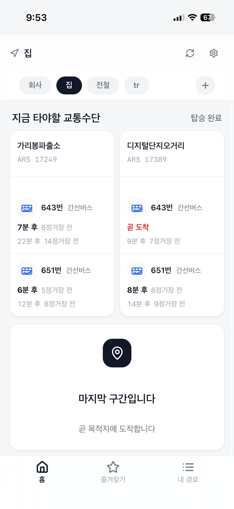
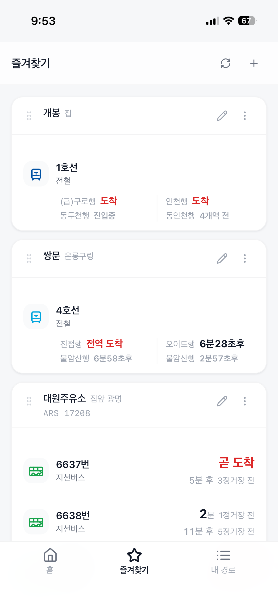

<p align="center">
  
</p>

<h1 align="center">when_come</h1>

<p align="center">
  <i>출퇴근, 그 한 줄의 정보를 위한 앱.</i>
</p>

<p align="center">
  매일 같은 버스, 같은 지하철.<br/>
  <b>when_come</b>은 길찾기를 덜어내고 "지금 그게 언제 오는지"에만 집중한 출퇴근 도착정보 앱입니다.
</p>

<p align="center">
  
  &nbsp;&nbsp;
  
</p>

<p align="center">
  <sub>홈: 등록한 경로의 현재 구간 실시간 도착 · 즐겨찾기: 단일 정류장·역 빠른 확인</sub>
</p>

---

## 기획 의도

네이버지도와 카카오맵은 훌륭한 종합 지도 서비스입니다. 다만 **평일 사용자의 동선은 이미 고정**되어 있습니다.
대부분의 출퇴근 길은 검색하지 않아도 알고 있고, 정작 매일 확인하고 싶은 정보는 단 하나입니다.

> "내가 타야 하는 그 버스, 그 지하철. 지금 언제 와?"

기존 앱에서 이 한 줄을 보려면 검색 → 정류장 선택 → 노선 탐색 → 방향 확인까지 네다섯 단계를 거쳐야 합니다.
**when_come은 경로를 한 번만 등록하면, 앱을 여는 순간 첫 화면이 곧 실시간 도착정보가 되도록 설계했습니다.**

종합 지도가 모두를 위한 도구라면, when_come은 매일 같은 길을 가는 사람을 위한 도구입니다.

---

## 핵심 경험

- **경로 단위 도착 대시보드** — 출근·퇴근 경로를 등록하면, 홈에서 모든 구간의 실시간 도착을 한 번에 확인합니다.
- **대안 정류장 그룹핑** — 한 스텝에 정류장 두 곳을 묶어, 둘 중 빨리 오는 차량을 자연스럽게 비교합니다.
- **지하철 방향 정확도** — 헤드사인과 상하행을 함께 저장해 반대 방향 열차의 오인을 차단합니다.
- **다중 사업자 통합** — 한 정류장에 서울버스와 경기버스가 공존하는 경우까지 노선 단위로 자동 분기합니다.
- **즐겨찾기 정류장** — 경로 외 단일 정류장을 별도 탭에서 빠르게 확인합니다.
- **PWA 모바일 최적화** — 백그라운드 복귀 시 즉시 재조회, 오프라인 인지, 키보드 inset 처리.

---

## 기술 스택

| 레이어 | 사용 기술 |
|--------|----------|
| Frontend | React 18 · TypeScript · Vite · Tailwind v4 · shadcn/ui · TanStack Query · @dnd-kit · Framer Motion |
| Backend | Supabase Edge Functions (Deno · TypeScript) · PostgreSQL · Row Level Security |
| 외부 API | 서울 버스 / 서울 지하철 / 경기도 GBIS / ODsay 대중교통 |
| 인프라 | Vercel · Supabase · GitHub Actions |

---

## 설계 의사결정

복잡도가 있는 결정은 ADR(Architecture Decision Record)로 남겨 추적성을 확보했습니다.

| ADR | 결정 |
|-----|------|
| [ADR-001](docs/decisions/ADR-001-subway-direction-model.md) | 지하철 방향 모델 — 헤드사인·상하행 이중 키로 매칭 정확도 확보 |
| [ADR-002](docs/decisions/ADR-002-multi-region-arrival-provider.md) | 다중 사업자 Provider 패턴 — `stop_routes.provider` 노선 단위 분기 |
| [ADR-002](docs/decisions/ADR-002-error-handling.md) | 에러 핸들링 정책 — `ErrorCode` union literal, BE·FE 코드 단일 진실 |
| [ADR-003](docs/decisions/ADR-003-design-system.md) | 디자인 시스템 — Tailwind 임의값 금지, 시멘틱 토큰 강제 |
| [ADR-003](docs/decisions/ADR-003-gbis-station-caching.md) | GBIS 정류소 캐싱 — 일 1회 cron 전체 동기화로 매핑 정확도 향상 |

---

## 프로젝트 구조

```
when_come/
├── when_come_fe/                React · TypeScript · Vite
│   └── src/
│       ├── features/            도메인 단위 (home · setup · route · favorites · stop-picker)
│       ├── components/          공유 (PageShell · PageHeader · BottomNav)
│       ├── lib/                 API client · arrival · errorToast · hooks
│       └── styles/              theme.css (디자인 토큰)
│
├── when_come_be/                Supabase Edge Functions (Deno)
│   └── supabase/functions/
│       ├── _shared/             auth · error · arrivalProvider · regionMapper
│       ├── arrival-info/        실시간 도착 (Provider 패턴 분기)
│       ├── routes/              경로 CRUD
│       ├── favorite-stops/      즐겨찾기 CRUD
│       └── ...
│
└── docs/                        계약 · ADR · 스펙 · 협업 노트
```

---

## 개발 원칙

- **Spec-Driven Development** — 새 기능은 PRD → SDD → TASKS 작성·승인 후 구현. 범위 밖 변경 금지.
- **TDD (Backend)** — Edge Function은 happy path · 400 · 401 · 404 · 502 · CORS preflight 케이스 테스트 선행.
- **에이전트 기반 협업 파이프라인** — `architect`(설계) → `be-agent` · `fe-agent`(병렬 구현) → `code-reviewer`(리뷰)를 `.claude/agents`로 정의.
- **문서 동기화 강제** — 구조 변경 시 `docs/architecture/overview.md` 자동 갱신 규칙 적용.

---

## 실행

**Frontend**
```bash
cd when_come_fe
npm install
npm run dev
```

**Backend**
```bash
cd when_come_be
supabase start
supabase functions serve
supabase db reset
```

로컬 개발용 계정: `dev@when-come.local` / `devpassword123`

---

## 배포

`main` → `prod` 브랜치 머지 및 push로 Vercel(Frontend)과 GitHub Actions(Backend)가 자동 배포합니다.
CLI 수동 배포는 차단되어 있습니다.

---

도메인 디테일 — 지하철 역명 fallback, 노선 매칭 규칙, byte-identical 중복 제거 등 — 은 `docs/tech-notes/`에 정리되어 있습니다.
